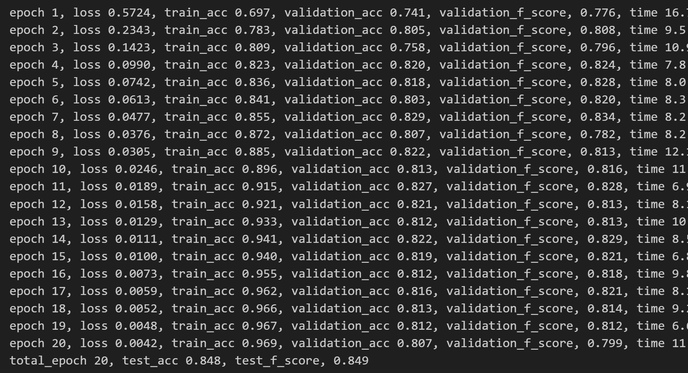

文本情感分类作业 代码部分README

### 环境配置

- requirements.txt中有所需要的环境，可以按照如下方式安装所需的包

```bash
pip install -r requirements.txt
```

### 运行代码

**不同模型存储在不同.ipynb文件中，以下为运行模型的步骤**

- 首先，打开train_xxxx.ipynb文件
- 其次，在每个.ipynb的**第二个单元格**中，可以**手动设置超参数**
- 最后，点击“运行全部单元格”即可看到“每轮训练的输出（包含train_acc validation_acc validation_f_score）”，以及最后“validation上面最优秀者在test集上的表现”（即test_acc test_f_score）
- 注意：所有模型的运行都需要在GPU进行（尤其Bert还要求GPU性能较好，才能快速完成训练和推理）

**输出格式如下**

- 
