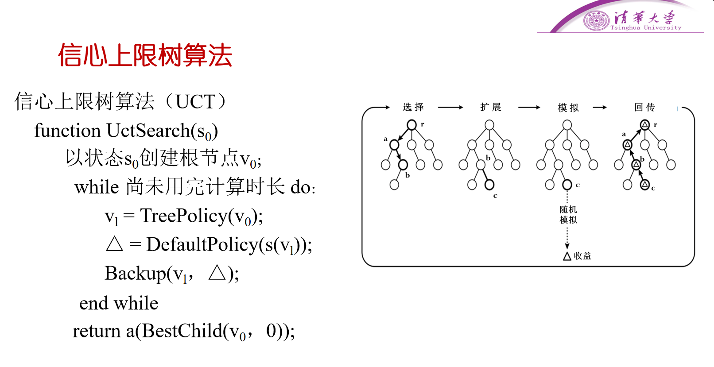
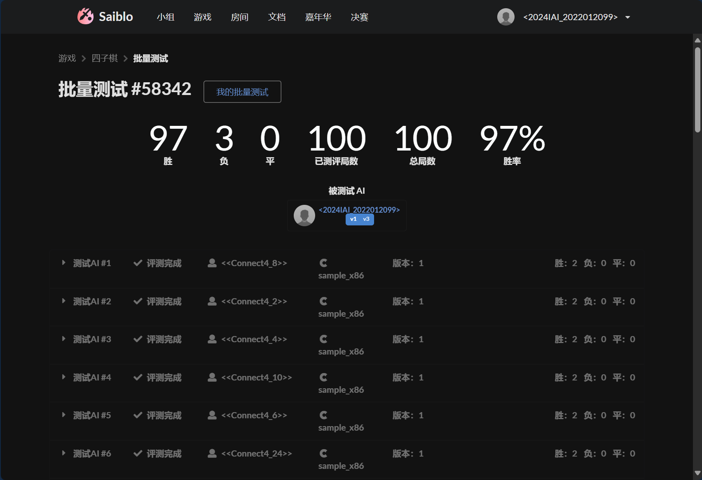

# 四子棋作业报告

## 策略说明

### 一、 信心上限树（UCT）基本方法（基本版本）

- UCT树按照图中4个步骤迭代扩展，到达“扩展数上限”（程序中设定5e5）或“扩展时间上限”（程序中2.0s）时，停止扩展节点，并在根节点的子节点中选择最优者，作为“决定即将走的子”

#### 1.选择节点

- 对于当前所在节点，若不是叶节点，且无可扩展的子节点，则在子节点中选择评分最大者进行搜索
- 评分标准

$$
I_j = \bar{X}_j + c\sqrt{\frac{2ln(n)}{T_j(n)}}
$$

- 说明：$\bar{X}_j$为“该子节点收益与搜索次数之比”，刻画选择子节点后估计的胜率；$\frac{2ln(n)}{T_j(n)}$刻画该节点被搜索的相对频率，使得“被搜索数量少的节点，更有机会被搜索”，增加UCT探索未知节点的机会；c为调节因子，平衡“节点已知的胜率”和“节点未知的可能性”，c越小，策略越保守，c越大，策略可能性越大、随机性越大。

#### 2.扩展

- 若当前节点有可扩展子节点，则随机选择一个子节点进行扩展

### 3.随机模拟

- 对于新扩展的节点，基于其当前棋面，程序轮流模拟下棋两方不断走子（走子可以随机走子，也可以在较少的计算量的条件下，尽量提升走子质量，报告后续会详细说明），直到得到结果（胜/负/平），将该结果记为新扩展节点的初始收益。

### 4.回传

- 当搜索到叶节点，或新扩展了节点，则依据当前节点的收益（胜对应1，负对应-1，平对应0），沿着搜索路径反向传递，每个祖先节点都在已有收益上添加该收益，且搜索次数都加1。

### 二、紧急情况处理

- 对于“我方再走某一步，就获立刻胜”、“如果自己不走某一步，对方走某一步，则对方立刻获胜”、“若自己走了某一步，则对方有机会一步获胜”这三种情况，应该优先考虑。对于前两种情况，则立刻走对应的子；对于第三种情况，则应该避免走该步。
- （对于第三种情况，是基于“对手有足够的判断能力”而言，因此在与水平中等的AI对战时，可能反而会因为这样的判断限制我方走子可能性，仅提升了在与大于等于80号AI对战中的胜率。在多次测试后，我将该判断删除了。）

### 三、移动根节点

- 考虑下一轮的UCT树，其根节点是当前UCT树“从根节点中选择一个子节点（代表本轮我方走子），再在该子节点中选择一个子节点（代表我方走子后，对方走子）”，即下一轮UCT树的根节点是当前UCT树某一个孙辈节点，因此每次走子时，新的UCT树将基于原有UCT树来扩展。
- 具体而言：新的UCT树在原有UCT树上选定根节点，接着释放原有UCT树的其他无用节点（即原UCT树的其余孙辈节点、所有子节点、原根节点），接着基于新的根节点进行“选择、扩展、模拟、回传”，最后在新的UCT树中选择子节点作为建议的走子。（注意，若每轮均为2.0s搜索时间，则UCT树经过多轮迭代有可能因为节点数过多而占用空间过大，因此对根节点和每个孙辈节点记录其子树节点总数，限制UCT树节点小于5e5）。
- 优点：减少相同信息的计算；不会因为时间限制导致UCT树搜索不充分，导致降低决策质量

### 四、节点扩展

- 基本策略：当搜索到“仍有未被扩展的子节点”的点时，在备选子节点中随机挑选一个节点扩展（而非按照y值的大小排序，再顺序扩展）（经过试验，顺序扩展会略微降低性能）。
- 在扩展节点的时候同时也考虑“必须走的子”：即若某节点的子节点代表我方必胜、或者如果不走而对方走子导致对方必胜，则只扩展这类“必须处理的情况”，而不扩展其他节点。这样做可以让更多的搜索精力放在可能性最高的情况，使得在有限的搜索时间和搜索次数内能得到更好的计算收益。

### 五、模拟随机走子的方法

- 法一：随机走子。按照基本的UCT树策略，模拟走子的时候双方在己方可以走的子中随机选择一个可能来落子，该方法使得模拟速度快，但是对“当前棋面本身不明朗”的节点而言，该方法不太能评估出对应棋面的好坏。
- 法二：维护一个“评估棋盘”。维护一个N x M的棋盘，棋盘每个格子记录“UCT中每个节点对应的棋面，对该格子的访问次数、收益profile”（具体来说，UCT上某一个节点被访问a次，收益为b，对应的棋面中在某个格子走了我方的子，则在“评估棋盘”中对应的格子上记录“我方的子”的个数加a，收益对应加b）。随机走子时，对于候选的走子位置，计算“收益除以访问次数”（当然对于不同方，收益可能要取负值再来比较，暂时忽略细节），取最优者进行走子。该方法虽然需要在“回传”步骤中同步更新“评估棋盘”，同时模拟走子的时候也要进行除法计算，但避免用rand()产生随机数，在试验中也表现很好（但是在适应“移动根节点”的时候需要更改调试，而此次作业时间有限，因此后续放弃了这个方法）。
- 法三：尽量靠近中间走子。为了使得随机模拟的速度快，同时又尽量增加“假想的对战双方”的智力，经过观察，一般靠近中间的走子，容易与周围产生连接，往往有更大作用（或者说有更大概率是一个优秀的走子），因此在随机走子的过程中尽量增加中间子的权重（具体实现中，类似于将[0,1]区间切分成不同段，每一段长度不同，分别对应不同的走子位置，而靠近中间的走子的段长度更大，于是在[0,1]中随机选一个点，该点落在哪一段中，就走对应的棋子）（最终采用了法三）

### 六、返回节点

- 可以选择返回子节点中$\bar{X}_j$最大者，也可以选择返回子节点中搜索次数最多者（经过打印信息，绝大部分情况两者返回同样的节点），试验中无明显差异，本人最终采用前者。

### 七、关于收益

- 最终采用0 1 -1为收益。最开始本人采用0 1 2作为收益，而“根据不同视角来思考，收益应该取负”，不如0 1 -1直观，而且普遍推荐的“取超参数值c=0.707”使用于以0 -1 1为收益的情况，本人在用0 1 2作为收益时候没有找到较好参数，因此采用0 1 -1为收益。

## 评测结果及统计数据

### 1. 最高测评结果：胜率97%

| 胜数 | 负数 | 平数 |
| ---- | ---- | ---- |
| 97   | 3    | 0    |

- 

### 2. 平均测评结果

- 该结果基于在平台测试10次，每次与偶数编号的AI对战共100轮

| 胜数 | 负数 | 平数 |
| ---- | ---- | ---- |
| 942  | 58   | 0    |

- 平均胜率为**94.2%**

## 致谢和声明

- 首先，感谢老师和助教提供了完成本次作业的机会，能在详细的说明资料和鲁棒的测试平台上写自己的下棋AI、进行人机对战，不仅一部分的满足了我对人工智能领域的好奇心，更提升了我的代码能力、动手能力，加深了我对蒙特卡洛搜索算法的理解。
- 其次，本人声明：作业思路参考了课件，并与计23万子豪同学、计28左晨阳同学相互交流了少部分策略和参数设置，最终独立完成代码的编写和调试。
